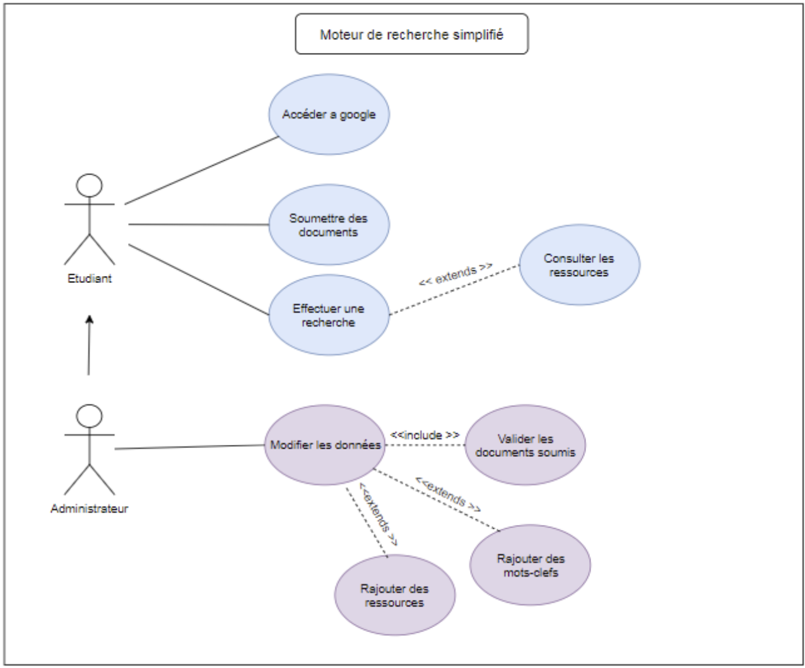

<h1 align="center">
  
</h1>

---

# MOTEUR DE RECHERCHE

## Petit résumé
- Les moteurs de recherche sont maintenant des outils indispensables à tout le monde. Il en existe de toutes sortes mais il est parfois difficile de trouver ce que l'on cherche en fonction des mots clés que l'on utilise.

## Objectifs
- Concevoir un moteur de recherche dédié à une spécialité et alimenté par les utilisateurs avec les réponses les plus pertinentes.

## Techno
- HTML
- CSS
- SQL
- Oracle
- FileZila

## UML

## Auteur
- [@Pierre](https://github.com/Pierre-Portfolio)
